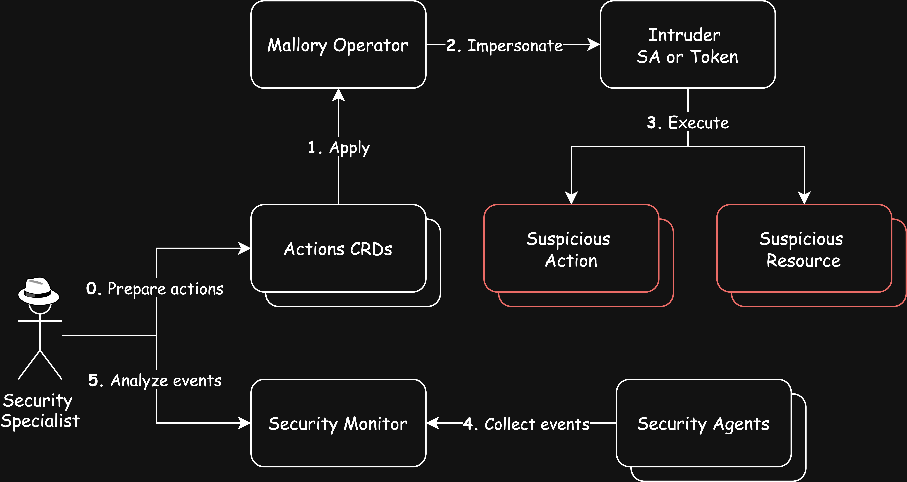

# Mallory Operator

Kubernetes controller for modeling threat scenarios. It creates resources and executes malicious actions such as reconnaissance, privilege escalation, and data exfiltration to evaluate security measures.
> [!IMPORTANT]  
>  **Mallory Operator** is intended for controlled and ethical use only. Ensure that simulations are conducted in compliant environments and in accordance with legal requirements.

## Features
- **Dynamic Resource Creation:** automatically generating Kubernetes resources to replicate different scenarios.
  
- **Threat Simulation:** executing actions including:
  - **Reconnaissance:** collecting cluster information.
  - **Privilege Escalation:** imitating attempts to gain elevated access.
  - **Data Exfiltration:** imitating the extraction of sensitive data.
  
- **Customizable Scenarios:** configuring simulation parameters to suit various testing requirements.

- **Training and Testing:** providing a controlled environment for security defenses audit and incident response trainings.

### Use Cases

- **Security Testing:** assess the effectiveness of security measures, detection systems, and response processes.

- **Incident Response Drills:** practice and refine response procedures for different threat scenarios.

- **Educational Purposes:** demonstrate simulated threat activities for security training sessions.

## Getting Started

### Deploy on the cluster
Mallory Operator is deployed via Helm using the following command:
```sh
helm install mallory oci://registry-1.docker.io/explabs/mallory
```

> [!NOTE] 
>  If you encounter RBAC errors, you may need to grant yourself cluster-admin
privileges or be logged in as admin.
### Setup Intruder
Apply ServiceAccount and ClusterRole of the user Intruder:
```sh
kubectl apply -f intruder/manifests
```
> [!TIP]
> Visit [Docs](./intruder/README.md) about **Intruder** image that is used for advanced threat modeling.

### Apply Actions
You can apply the examples from the `actions` directory:

```sh
kubectl apply -f actions
```

### Uninstall
```sh
helm uninstall mallory
```

## Concept


### Actions List
| Action                            | Rule | Description |
| --------------------------------- | ---- | ----------- |
| create-hostnetwork-pod            |      |             |
| create-node-port-svc              |      |             |
| create-privileged-pod             |      |             |
| create-role-with-exec             |      |             |
| create-role-with-wildcard         |      |             |
| create-role-with-write-privileges |      |             |
| create-sensitive-mount-deployment |      |             |
| create-vanilla-sa                 |      |             |
| exec-pod                          |      |             |
| list-cluster-roles                |      |             |
| list-permissions                  |      |             |
| list-roles                        |      |             |
| logs-pod                          |      |             |

### About CRD
```yaml
apiVersion: mallory.io/v1
kind: Event
metadata:
  name: create-privileged-pod
spec:
  # actions are taken on his behalf
  intruder:
    serviceAccount: intruder
    # or
    # token: <Token>
  operations:
  - id: privileged-pod
    verb: create # get, list, update etc. Special: auth, exec, logs
    # YAML resource definition
    resource: 
      apiVersion: v1
      kind: Pod
      metadata:
        name: privileged-pod
        labels:
          app.kubernetes.io/part-of: mallory-operator
      spec:
        containers:
        - name: web
          image: nginx:alpine
          securityContext:
            privileged: true
          ports:
          - containerPort: 80
```

## Contributing
// TODO(user): Add detailed information on how you would like others to contribute to this project

