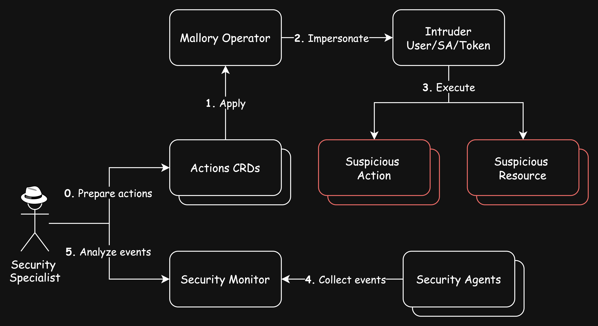

# Mallory Operator

Kubernetes controller for modeling threat scenarios. It creates resources and executes actions such as reconnaissance, privilege escalation, and data exfiltration to evaluate security measures.

## Features
- **Dynamic Resource Creation:** Automatically generate Kubernetes resources to replicate different scenarios.
  
- **Threat Simulation:** Execute actions including:
  - **Reconnaissance:** Collect cluster information.
  - **Privilege Escalation:** Imitate attempts to gain elevated access.
  - **Data Exfiltration:** Simulate the extraction of sensitive data.
  
- **Customizable Scenarios:** Configure simulation parameters to suit various testing requirements.

- **Training and Testing:** Provide a controlled environment for evaluating security defenses and training on incident response.

### Use Cases

- **Security Testing:** Assess the effectiveness of security measures, detection systems, and response processes.

- **Incident Response Drills:** Practice and refine response procedures for different threat scenarios.

- **Educational Purposes:** Demonstrate simulated threat activities for security training sessions.
> [!IMPORTANT]  
>  Mallory Operator is intended for controlled and ethical use only. Ensure that simulations are conducted in compliant environments and in accordance with legal requirements.

## Getting Started

### Deploy on the cluster

```sh
helm install mallory oci://registry-1.docker.io/explabs/mallory
```

> [!NOTE] 
>  If you encounter RBAC errors, you may need to grant yourself cluster-admin
privileges or be logged in as admin.

### Apply Actions
You can apply the examples from `actions` directory:

```sh
kubectl apply -f actions
```

> [!NOTE] 
>  Ensure that the samples has default values to test it out.

### Uninstall
```sh
helm uninstall mallory
```

## Concept


### Actions List
| Action                            | Rule | Description |
| --------------------------------- | ---- | ----------- |
| create-hostnetwork-pod            |      |             |
| create-node-port-svc              |      |             |
| create-privileged-pod             |      |             |
| create-role-with-exec             |      |             |
| create-role-with-wildcard         |      |             |
| create-role-with-write-privileges |      |             |
| create-sensitive-mount-deployment |      |             |
| create-vanilla-sa                 |      |             |
| exec-pod                          |      |             |
| list-cluster-roles                |      |             |
| list-permissions                  |      |             |
| list-roles                        |      |             |
| logs-pod                          |      |             |

### About CRD
```yaml
apiVersion: mallory.io/v1
kind: Event
metadata:
  name: create-privileged-pod
spec:
  # actions are taken on his behalf
  intruder:
    serviceAccount: intruder
    # or
    # token: <Token>
  operations:
  - id: privileged-pod
    verb: create # get, list, update etc. Special: auth, exec, logs
    # YAML resource definition
    resource: 
      apiVersion: v1
      kind: Pod
      metadata:
        name: privileged-pod
        labels:
          app.kubernetes.io/part-of: mallory-operator
      spec:
        containers:
        - name: web
          image: nginx:alpine
          securityContext:
            privileged: true
          ports:
          - containerPort: 80
```

## Contributing
// TODO(user): Add detailed information on how you would like others to contribute to this project

