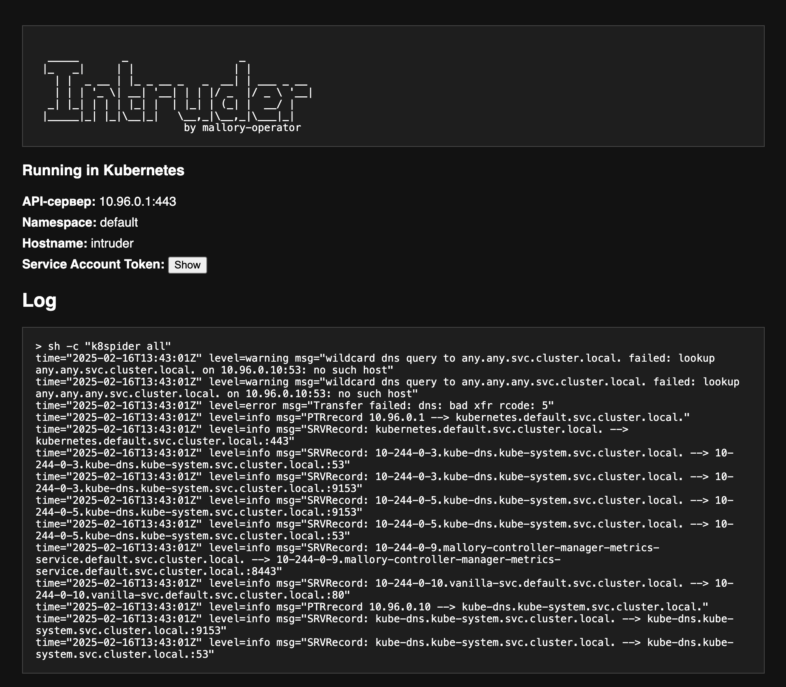

# Intruder Image
Container with tools for threat modelling
## Docker(local)
```sh
docker run --rm -p 8080:8080 explabs/mallory-intruder "ping -c 5 google.com"

  _____       _                  _           
 |_   _|     | |                | |          
   | |  _ __ | |_ _ __ _   _  __| | ___ _ __ 
   | | | '_ \| __| '__| | | |/ _  |/ _ \ '__|
  _| |_| | | | |_| |  | |_| | (_| |  __/ |   
 |_____|_| |_|\__|_|   \__,_|\__,_|\___|_|   
                        by mallory-operator

2025/02/16 13:38:40 server starts on :8080
2025/02/16 13:38:40 input command: ping -c 5 google.com
```
## Kubernetes
Apply Kubernetes manifest
```sh
kubectl apply -f - <<EOF
apiVersion: v1
kind: Pod
metadata:
  name: intruder
spec:
  containers:
  - name: intruder
    image: explabs/mallory-intruder
    args: 
    - "k8spider all"
EOF
# port-forward to localhost:8080
kubectl port-forward intruder 8080:8080
```
Access web page on: https://localhost:800



| Utility             | Description                                                                                      | Source                                                            |
| ------------------- | ------------------------------------------------------------------------------------------------ | ----------------------------------------------------------------- |
| **kubectl**         | CLI for managing clusters and simulating configuration errors.                                   | [Kubernetes Docs](https://kubernetes.io/docs/reference/kubectl/)  |
| **k8spider**        | Enumerates cluster resources to simulate lateral movement and resource exposure.                 | [k8spider GitHub](https://github.com/k8spider/k8spider)           |
| **event-generator** | Generates simulated security events to test Falco’s runtime detection rules.                     | [Falco Docs](https://falco.org/)                                  |
| **kube-hunter**     | Penetration testing tool that scans for vulnerabilities and misconfigurations in clusters.       | [kube-hunter GitHub](https://github.com/aquasecurity/kube-hunter) |
| **nmap**            | Network scanner for simulating reconnaissance and discovering open ports and services.           | [Nmap Official](https://nmap.org/)                                |
| **kubescape**       | Scans clusters for misconfigurations and vulnerabilities, highlighting potential attack vectors. | [Kubescape GitHub](https://github.com/armosec/kubescape)          |
| **kube-bench**      | Checks cluster configuration against the CIS Kubernetes Benchmark to identify weaknesses.        | [kube-bench GitHub](https://github.com/aquasecurity/kube-bench)   |
| **kubeaudit**       | Audits Kubernetes clusters for security best practices and misconfigurations.                    | [kubeaudit GitHub](https://github.com/Shopify/kubeaudit)          |